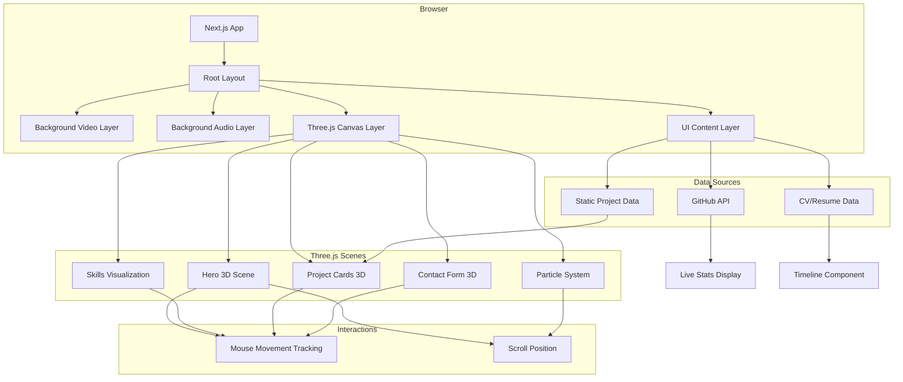

# Advanced 3D Features & Interactive Elements

## Technical Architecture Overview



## Current 3D Features (Baseline)

### 1. Hero 3D Scene
- **Interactive Geometric Shapes**: Floating cubes, spheres, toruses
- **Parallax Effect**: Responds to mouse movement
- **Auto-rotation**: Gentle continuous rotation
- **Lighting**: Dynamic spotlight following cursor

### 2. Skills Visualization
- **3D Skill Orbs**: Each skill as a floating sphere
- **Hover Effects**: Expand and glow on hover
- **Connecting Lines**: Link related skills
- **Rotation on Scroll**: Scene rotates as user scrolls

### 3. Project Cards
- **3D Tilt Effect**: Cards tilt based on mouse position
- **Depth on Hover**: Cards lift off the page
- **Animated Borders**: Glowing animated outlines
- **Smooth Transitions**: All interactions smoothly animated

### 4. Background Particles
- **Ambient Particles**: Subtle floating particles throughout
- **Parallax Depth**: Multiple layers at different depths
- **Interactive**: React to cursor proximity

## Advanced 3D Features - Options to Consider

### Option A: Immersive 3D Environments

#### Hero Scene Enhancements
- **3D Terminal/Code Editor**: Floating holographic code snippets
- **Animated Galaxy**: Stars and nebulae background
- **Floating Islands**: Portfolio sections on separate floating platforms
- **Camera Fly-through**: Automated camera path on page load
- **Shader Effects**: Custom GLSL shaders for unique visuals

#### Implementation Complexity: High
#### Visual Impact: Very High
#### Performance Cost: Medium-High

### Option B: Interactive Data Visualization

#### Skills Section
- **3D Skill Tree**: Branching tree structure showing skill relationships
- **Animated Graph Network**: Nodes and edges showing technology stack
- **Rotating Skill Constellation**: Skills as stars in a constellation
- **DNA Helix**: Double helix showing frontend/backend skills
- **Skill Level Bars**: Extruded 3D bar charts

#### Projects Section
- **3D Project Gallery**: Walk-through gallery space
- **Floating Monitors**: Projects displayed on 3D screens
- **Tech Stack Visualization**: 3D representation of technologies used
- **Timeline Spiral**: Projects arranged on a 3D spiral timeline

#### Implementation Complexity: Medium
#### Visual Impact: High
#### Performance Cost: Medium

### Option C: Gamified Experience

#### Interactive Elements
- **Easter Eggs**: Hidden 3D objects to discover
- **Achievement System**: Unlock 3D models as user explores
- **Mini-game**: Simple browser-based 3D game showcasing skills
- **Interactive Puzzles**: Solve 3D puzzles to reveal content
- **Progress Bar**: 3D loading bar showing portfolio completion

#### Implementation Complexity: High
#### Visual Impact: Very High
#### Performance Cost: Low-Medium

### Option D: Physics & Simulation

#### Physics-based Interactions
- **Gravity Simulation**: Objects fall and bounce
- **Cloth Simulation**: Fabric-like CV/resume
- **Fluid Dynamics**: Liquid metal effects
- **Ragdoll Physics**: Interactive character
- **Collision Detection**: Objects interact with cursor

#### Implementation Complexity: Very High
#### Visual Impact: Very High
#### Performance Cost: High

### Option E: AR/VR Ready Elements

#### Mixed Reality Features
- **WebXR Support**: VR headset compatibility
- **Hand Tracking**: Interact without controllers
- **Spatial Audio**: 3D positioned audio
- **AR Business Card**: Scannable 3D business card
- **Virtual Office**: Walk through a 3D workspace

#### Implementation Complexity: Very High
#### Visual Impact: Exceptional
#### Performance Cost: High

### Option F: Minimalist Elegance

#### Subtle 3D Enhancements
- **Depth Layers**: Simple parallax with depth
- **Glassmorphism 3D**: Frosted glass effects with depth
- **Floating Cards**: Subtle elevation changes
- **Micro-interactions**: Small 3D responses to actions
- **Smooth Transitions**: Focus on fluid motion

#### Implementation Complexity: Low
#### Visual Impact: Medium-High
#### Performance Cost: Low

## Recommended Feature Set

Based on portfolio best practices and modern web trends, I recommend a **Balanced Approach** combining:

### Tier 1: Core Features (Must Have)
1. ✅ **Hero 3D Scene** with interactive geometric shapes
2. ✅ **Particle System** ambient background
3. ✅ **3D Project Cards** with tilt and hover effects
4. ✅ **Smooth Scroll Animations** throughout
5. ✅ **Glassmorphism UI** with depth

### Tier 2: Enhanced Features (High Impact)
6. 🎯 **3D Skill Constellation** - Skills as connected stars
7. 🎯 **Floating Code Snippets** - Holographic code in hero
8. 🎯 **Interactive Timeline** - 3D experience timeline
9. 🎯 **Cursor Trail Effect** - Particle trail following cursor
10. 🎯 **Section Transitions** - 3D morphing between sections

### Tier 3: Advanced Features (Optional)
11. ⚡ **Shader Effects** - Custom visual effects
12. ⚡ **Physics Interactions** - Bouncing/gravity on certain elements
13. ⚡ **Mini-game Easter Egg** - Hidden Brick Breaker game
14. ⚡ **3D Terminal** - Interactive terminal in hero
15. ⚡ **WebGL Post-processing** - Bloom, chromatic aberration

## Specific Feature Recommendations

### 1. Animated 3D Name/Logo
- Your name appears as extruded 3D text
- Rotates slowly
- Glows with gradient colors
- Responds to mouse hover with distortion

### 2. Skill Constellation
```
Each skill = Star in space
Related skills = Connected by lines
Hover on skill = Brightens and shows description
Scroll = Constellation rotates
Click skill = Zooms to related projects
```

### 3. Project Showcase: 3D Gallery
```
Projects displayed on floating monitors
Click to approach monitor
Monitor shows live demo preview
GitHub stats orbit around monitor
Tech stack badges as floating chips
```

### 4. Contact Section: Holographic Form
```
Form fields appear as 3D holograms
Input creates ripple effects
Submit button = 3D animated button
Success = Particle explosion effect
```

### 5. Loading Experience
```
3D loading animation
Your logo assembles from particles
Progress bar with 3D depth
Smooth transition to main content
```

### 6. Cursor Effects
```
Custom 3D cursor
Particle trail following movement
Changes shape on hover
Magnetic effect on buttons
```

### 7. Scroll-triggered Animations
```
Elements fade in with 3D rotation
Parallax on different depth layers
Camera moves through 3D space
Sections morph into view
```

## Technical Implementation Notes

### Libraries & Tools
- **@react-three/fiber** - React renderer for Three.js
- **@react-three/drei** - Helpers (Controls, Text3D, etc.)
- **@react-three/postprocessing** - Effects (Bloom, etc.)
- **three-stdlib** - Additional Three.js utilities
- **@theatre/r3f** - Animation timeline (optional)
- **cannon-es** - Physics engine (if using physics)
- **maath** - Math utilities for 3D

### Performance Optimization
- **Level of Detail (LOD)**: Simpler models on mobile
- **Instancing**: Reuse geometries for particles
- **Frustum Culling**: Only render visible objects
- **Lazy Loading**: Load 3D scenes on scroll
- **Web Workers**: Heavy calculations off main thread
- **Adaptive Quality**: Reduce quality on low-end devices

### Browser Compatibility
- WebGL 2.0 support required
- Fallback to simpler visuals for older browsers
- Mobile optimization with reduced effects
- Touch gesture support for mobile interactions

## Questions for You

To finalize the feature set, please choose from these options:

1. **Visual Style Preference**:
   - Futuristic/Cyberpunk (neon, holographic)
   - Minimalist/Elegant (subtle, clean)
   - Playful/Creative (colorful, dynamic)
   - Professional/Corporate (sophisticated, refined)

2. **Hero Section Focus**:
   - Geometric shapes (abstract, modern)
   - Code/Terminal theme (developer-focused)
   - Space/Galaxy theme (cosmic, vast)
   - Custom 3D logo/name (personal brand)

3. **Skills Visualization**:
   - Constellation (stars and connections)
   - Skill Tree (hierarchical structure)
   - Particle Cloud (organic, flowing)
   - 3D Bar Charts (data-focused)

4. **Project Display**:
   - Floating Cards (standard, elegant)
   - 3D Gallery/Monitors (immersive)
   - Timeline Spiral (chronological)
   - Grid with 3D Hover (balanced)

5. **Performance vs Visual Impact**:
   - Maximum visual impact (may be slower on low-end devices)
   - Balanced approach (good visuals, good performance)
   - Performance first (simpler 3D, faster load)

6. **Special Features** (pick 2-3):
   - Easter egg mini-game
   - Interactive terminal
   - Physics-based interactions
   - Shader effects (custom visuals)
   - Cursor particle trail
   - Section morphing transitions
   - 3D animated loading screen
   - Holographic contact form

Please let me know your preferences and I'll update the todo list with the specific features you want!