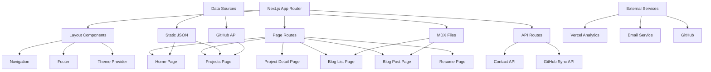
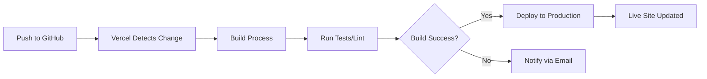

# Portfolio Architecture Plan

## Project Overview
A modern, professional Next.js 14+ portfolio with advanced features, optimized for free hosting on Vercel.

## Technology Stack

### Core Framework
- **Next.js 14+** - React framework with App Router
- **TypeScript** - Type safety and better developer experience
- **React 18+** - UI library with server components

### Styling & UI
- **Tailwind CSS** - Utility-first CSS framework
- **Framer Motion** - Animation library
- **Shadcn/ui** - Accessible component library
- **Lucide Icons** - Modern icon set

### Content & Data
- **MDX** - Markdown with JSX for blog posts
- **GitHub API** - Dynamic project fetching
- **JSON/TypeScript** - Static data management

### Features & Integrations
- **Resend/EmailJS** - Contact form email handling
- **Vercel Analytics** - Page view tracking
- **next-themes** - Dark/light mode
- **React Syntax Highlighter** - Code display

### Deployment
- **Vercel** - Free hosting with automatic deployments
- **GitHub** - Version control and CI/CD

## Site Structure

```
Portfolio Site
├── Home Page (Hero + Overview)
├── About Section
│   ├── Bio
│   ├── Skills Grid
│   └── Timeline (Experience/Education)
├── Projects Section
│   ├── Project Grid with Filters
│   ├── Search Functionality
│   └── Individual Project Pages
│       ├── Live Demo Embed
│       ├── Screenshots/Gallery
│       ├── Tech Stack
│       └── GitHub Link
├── Blog Section
│   ├── Article List
│   └── Individual Blog Posts (MDX)
├── Resume/CV Section
│   ├── Interactive Viewer
│   └── Download Button
├── Contact Section
│   └── Contact Form with Validation
└── Footer
    ├── Social Links
    └── Copyright
```

## Application Architecture



## Key Features Breakdown

### 1. Dynamic Project Integration
- Automatically fetch projects from GitHub
- Manual override with curated project data
- Embed live demos using iframes
- Project categorization and tagging
- Search and filter functionality

### 2. Advanced UI/UX
- Smooth page transitions with Framer Motion
- Parallax scrolling effects
- Interactive 3D elements (optional)
- Micro-interactions on hover/click
- Loading skeletons for better perceived performance

### 3. Content Management
- MDX for rich blog posts with embedded components
- Syntax highlighting for code snippets
- Image optimization with Next.js Image
- Table of contents generation for blog posts

### 4. Performance Optimizations
- Server-side rendering for SEO
- Static generation where possible
- Image optimization and lazy loading
- Code splitting by route
- Font optimization with next/font

### 5. SEO & Analytics
- Dynamic metadata for each page
- OpenGraph images
- Sitemap generation
- robots.txt configuration
- Structured data (JSON-LD)
- Vercel Analytics integration

### 6. Accessibility
- Semantic HTML
- ARIA labels
- Keyboard navigation
- Color contrast compliance
- Screen reader optimization

## Deployment Strategy

### Free Hosting Options
1. **Vercel** (Recommended)
   - Automatic deployments from GitHub
   - Edge network CDN
   - Analytics included
   - Custom domain support

2. **Netlify** (Alternative)
   - Similar features to Vercel
   - Good for static sites

### CI/CD Pipeline


## File Structure

```
pranoys-portfolio/
├── public/
│   ├── resume/
│   │   └── pranoy-cv.pdf
│   ├── projects/
│   │   └── [project-screenshots]
│   └── images/
│       └── [profile, backgrounds, etc]
├── src/
│   ├── app/
│   │   ├── layout.tsx
│   │   ├── page.tsx
│   │   ├── projects/
│   │   │   ├── page.tsx
│   │   │   └── [slug]/
│   │   │       └── page.tsx
│   │   ├── blog/
│   │   │   ├── page.tsx
│   │   │   └── [slug]/
│   │   │       └── page.tsx
│   │   ├── resume/
│   │   │   └── page.tsx
│   │   └── api/
│   │       ├── contact/
│   │       │   └── route.ts
│   │       └── github/
│   │           └── route.ts
│   ├── components/
│   │   ├── ui/ (shadcn components)
│   │   ├── sections/
│   │   │   ├── Hero.tsx
│   │   │   ├── About.tsx
│   │   │   ├── Projects.tsx
│   │   │   ├── Skills.tsx
│   │   │   ├── Timeline.tsx
│   │   │   └── Contact.tsx
│   │   ├── layout/
│   │   │   ├── Navigation.tsx
│   │   │   └── Footer.tsx
│   │   └── features/
│   │       ├── ProjectCard.tsx
│   │       ├── BlogCard.tsx
│   │       ├── ThemeToggle.tsx
│   │       └── ContactForm.tsx
│   ├── lib/
│   │   ├── utils.ts
│   │   ├── github.ts
│   │   ├── mdx.ts
│   │   └── email.ts
│   ├── data/
│   │   ├── projects.json
│   │   ├── skills.json
│   │   └── experience.json
│   ├── content/
│   │   └── blog/
│   │       └── [blog-posts].mdx
│   └── styles/
│       └── globals.css
├── .env.local
├── .gitignore
├── next.config.js
├── tailwind.config.ts
├── tsconfig.json
├── package.json
└── README.md
```

## Advanced Features Details

### 1. GitHub Integration
- Fetch repositories automatically
- Display stars, forks, and language stats
- Link to live demos and source code
- Show commit activity

### 2. Blog System
- MDX support for interactive content
- Code syntax highlighting
- Reading time estimation
- Tag-based filtering
- RSS feed generation

### 3. Contact Form
- Client-side validation with Zod
- Server-side email sending
- Rate limiting to prevent spam
- Success/error notifications

### 4. Theme System
- Dark/light mode toggle
- System preference detection
- Smooth transitions
- Persistent user choice

### 5. Analytics
- Page views tracking
- Popular projects monitoring
- User engagement metrics
- Performance monitoring

## Development Workflow

1. **Setup Phase**: Initialize Next.js, configure tooling
2. **UI Foundation**: Build layout, navigation, theme system
3. **Core Sections**: Implement hero, about, skills, timeline
4. **Project System**: Create dynamic project pages and integration
5. **Blog Setup**: Configure MDX and create blog pages
6. **Features**: Add contact form, CV viewer, animations
7. **Polish**: SEO, analytics, performance optimization
8. **Deployment**: Set up Vercel, configure domain

## Next Steps

Once you approve this architecture, we'll switch to Code mode to implement:
1. Project initialization with all dependencies
2. Base configuration files
3. Component structure
4. Styling system
5. Each section iteratively
6. Deployment setup

Would you like to modify any aspect of this plan?