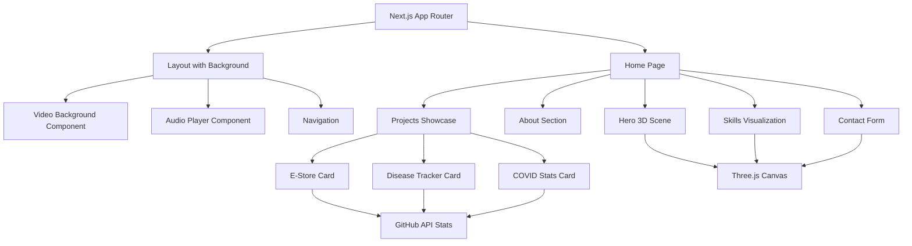

# State-of-the-Art Three.js Portfolio - Implementation Plan

## Project Overview
Building an interactive, immersive portfolio website using Next.js 14, Three.js, and React Three Fiber with background video and audio integration.

## Key Requirements
- **Background Video**: `finalvideoforPortfoliobkg.mp4` running continuously
- **Background Audio**: Daft Punk - "Veridis Quo" playing on loop
- **Interactive 3D**: Three.js-powered interactive elements throughout
- **GitHub Repo**: https://github.com/pranoybasu/pranoys-portfolio
- **Deployed Projects**:
  - E-Store: https://e-storebackend.up.railway.app/
  - Global Disease Tracker: https://global-disease-tracker.vercel.app/
  - COVID-19 Stats: https://coronavirus19stats.web.app/

## Technology Stack

### Core Framework
- **Next.js 14+** with App Router
- **TypeScript** for type safety
- **React 18+** with Server Components

### 3D Graphics & Animation
- **Three.js** - Core 3D library
- **@react-three/fiber** - React renderer for Three.js
- **@react-three/drei** - Useful helpers for R3F
- **@react-three/postprocessing** - Post-processing effects
- **Framer Motion** - Page transitions and UI animations

### Styling & UI
- **Tailwind CSS** - Utility-first styling
- **Shadcn/ui** - Component library
- **Glassmorphism** effects for modern UI

### Data & Integration
- **GitHub API** - Live repository statistics
- **MDX** - Future blog content support

### Deployment
- **Vercel** - Hosting and deployment
- **GitHub** - Version control

## Architecture Diagram



## Project Structure

```
pranoys-portfolio/
├── public/
│   ├── finalvideoforPortfoliobkg.mp4
│   ├── audio/
│   │   └── veridis-quo.mp3
│   ├── pranoy-resume.pdf
│   └── images/
├── src/
│   ├── app/
│   │   ├── layout.tsx
│   │   ├── page.tsx
│   │   └── globals.css
│   ├── components/
│   │   ├── layout/
│   │   │   ├── Navigation.tsx
│   │   │   ├── VideoBackground.tsx
│   │   │   └── BackgroundAudio.tsx
│   │   ├── sections/
│   │   │   ├── Hero.tsx
│   │   │   ├── About.tsx
│   │   │   ├── Skills.tsx
│   │   │   ├── Projects.tsx
│   │   │   └── Contact.tsx
│   │   ├── three/
│   │   │   ├── Scene3D.tsx
│   │   │   ├── FloatingParticles.tsx
│   │   │   ├── InteractiveSphere.tsx
│   │   │   └── ContactForm3D.tsx
│   │   └── ui/
│   │       ├── ProjectCard.tsx
│   │       └── (shadcn components)
│   ├── lib/
│   │   ├── github-api.ts
│   │   └── utils.ts
│   ├── data/
│   │   ├── projects.ts
│   │   ├── skills.ts
│   │   └── experience.ts
│   └── types/
│       └── index.ts
├── next.config.js
├── tailwind.config.ts
├── tsconfig.json
└── package.json
```

## Implementation Phases

### Phase 1: Project Setup (Tasks 1-3)
- Initialize Next.js 14 with TypeScript
- Install Three.js ecosystem (@react-three/fiber, @react-three/drei)
- Configure Tailwind CSS and Framer Motion
- Set up project folder structure

### Phase 2: Background Media (Tasks 4-5)
- Create VideoBackground component with video element
- Implement auto-playing background audio at 75% volume
- No audio controls visible (seamless experience)
- Ensure video loops seamlessly
- Handle browser autoplay policies with user interaction fallback

### Phase 3: 3D Foundation (Tasks 6-8)
- Set up React Three Fiber Canvas
- Create basic 3D hero scene with interactive elements
- Build navigation with glassmorphism effects
- Implement smooth scroll behavior
- Add hero section with animated text and 3D backdrop

### Phase 4: Content Sections (Tasks 9-10)
- Build About section using CV data
- Create interactive timeline for experience
- Design Skills section with 3D particle visualization
- Add skill categories with hover effects

### Phase 5: Projects Showcase (Tasks 11-15)
- Create Projects section layout
- Build ProjectCard component with 3D hover effects
- Add E-Store project with live demo link and screenshots
- Add Global Disease Tracker with live demo
- Add COVID-19 Stats with live demo
- Integrate GitHub API for repository stats (stars, forks, languages)

### Phase 6: Contact & Polish (Tasks 16-18)
- Build 3D Contact form with interactive elements
- Add Resume download button
- Implement page transitions with Framer Motion
- Add scroll-triggered animations

### Phase 7: Responsive & SEO (Tasks 19-21)
- Create responsive breakpoints for all sections
- Optimize 3D performance for mobile devices
- Add SEO metadata and OpenGraph tags
- Implement image optimization
- Set up code splitting for faster loads

### Phase 8: Deployment (Tasks 22-25)
- Connect to GitHub repository
- Configure Vercel project
- Set up environment variables
- Deploy and test production build
- Verify all 3D elements, video, and audio work live

## Key Features to Implement

### 1. Video Background
```typescript
// Autoplay, loop, muted by default, full viewport coverage
<video autoPlay loop muted playsInline>
  <source src="/finalvideoforPortfoliobkg.mp4" type="video/mp4" />
</video>
```

### 2. Audio Player
```typescript
// Background music with controls
- Play/Pause toggle
- Volume control
- Persistent across page sections
- User-initiated (Chrome autoplay policy)
```

### 3. Three.js Scenes
- **Hero**: Floating geometric shapes, particle effects
- **Skills**: Interactive skill orbs or constellation
- **Contact**: 3D form with depth and shadows
- **Background**: Subtle particle system throughout

### 4. Project Cards
Each card includes:
- Project title and description
- Tech stack badges
- Live demo button
- GitHub stats (stars, forks, language)
- Screenshot/preview image
- 3D hover tilt effect

### 5. Animations
- Scroll-triggered fade-ins
- Parallax effects on video background
- Smooth page transitions
- Hover interactions on all clickable elements
- Loading animations for 3D scenes

## Performance Considerations

1. **Lazy Loading**: Load 3D scenes only when visible
2. **Code Splitting**: Separate Three.js bundle
3. **Video Optimization**: Compressed MP4 with reasonable bitrate
4. **Mobile Fallback**: Simpler 3D on lower-powered devices
5. **Suspense Boundaries**: Graceful loading states

## SEO Strategy

- Dynamic metadata for homepage
- Structured data for portfolio items
- Sitemap generation
- robots.txt configuration
- OpenGraph images for social sharing

## Timeline Estimate

- **Setup & Configuration**: 1-2 hours
- **Background Media**: 1 hour
- **3D Scenes**: 3-4 hours
- **Content Sections**: 3-4 hours
- **Projects Integration**: 2-3 hours
- **Responsive & Polish**: 2-3 hours
- **Deployment & Testing**: 1-2 hours

**Total**: ~13-19 hours

## Success Criteria

✅ Background video plays seamlessly on all devices
✅ Audio player works with user controls
✅ Three.js scenes are smooth (60fps target)
✅ All 3 projects display with live demo links
✅ GitHub stats update dynamically
✅ Responsive on mobile, tablet, desktop
✅ SEO optimized with meta tags
✅ Deployed successfully on Vercel
✅ Fast page load (<3s initial load)
✅ Accessible keyboard navigation

## Next Steps

Once you approve this plan, we'll switch to **Code mode** to begin implementation. I recommend starting with Phase 1 (Project Setup) and working through each phase systematically.