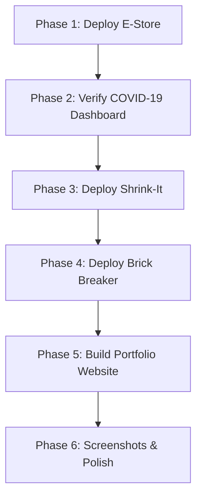
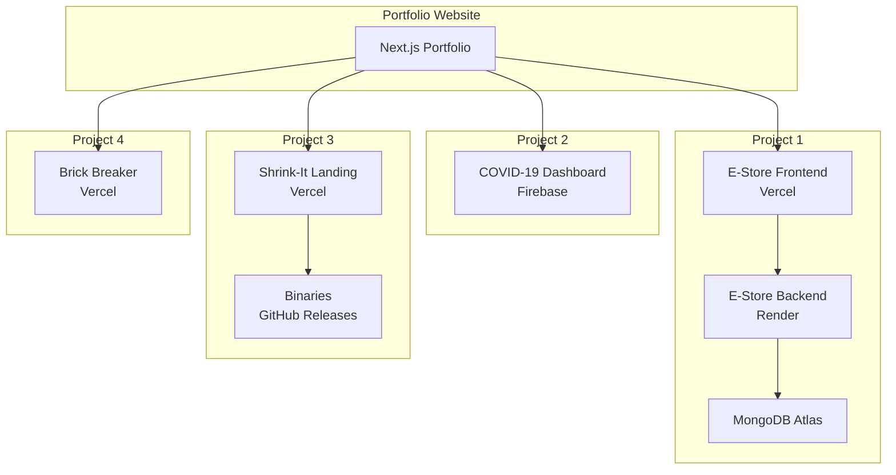

# Portfolio Project - Complete Plan Summary

## 🎯 Project Goal
Build a professional portfolio website showcasing 4 projects, with each project deployed and hosted for free on modern platforms, followed by a Next.js portfolio site that brings them all together.

---

## 📋 Project Inventory

| Project | Type | Tech Stack | GitHub | Current Status |
|---------|------|------------|--------|----------------|
| **E-Store** | Full-Stack Web App | MERN Stack | [Link](https://github.com/pranoybasu/E-store) | Needs deployment |
| **COVID-19 Dashboard** | Data Viz Web App | React, Leaflet, Charts | [Link](https://github.com/pranoybasu/coronavirus19stats) | ✅ Deployed at coronavirus19stats.web.app |
| **Shrink-It** | Desktop App | Electron, Node.js | [Link](https://github.com/pranoybasu/Shrink-It) | Needs landing page & releases |
| **Brick Breaker** | Game | Java Swing | [Link](https://github.com/pranoybasu/Brick-Breaker-Game) | Needs web conversion or showcase |

---

## 🚀 Implementation Strategy

### Phase-Based Approach



---

## 📦 Deployment Platforms

### Free Hosting Strategy

| Component | Platform | Why |
|-----------|----------|-----|
| E-Store Backend | Render | Free tier, auto-deploy, 750hrs/month |
| E-Store Frontend | Vercel | Best for React/Next.js, unlimited |
| E-Store Database | MongoDB Atlas | Free 512MB M0 tier |
| COVID-19 Dashboard | Firebase | Already deployed ✅ |
| Shrink-It Landing | Vercel | Fast static site hosting |
| Shrink-It Binaries | GitHub Releases | Free unlimited storage |
| Brick Breaker | Vercel | Web version or showcase page |
| Portfolio Website | Vercel | Next.js optimized, analytics included |

**Total Monthly Cost: $0** 🎉

---

## 🏗️ Architecture Overview

### System Diagram



---

## 📝 Implementation Phases

### Phase 1: E-Store Deployment (Tasks 1-9)
**Goal:** Get full-stack MERN app deployed and functional

**Key Steps:**
1. Review code and update dependencies
2. Set up MongoDB Atlas cluster
3. Configure environment variables
4. Deploy backend to Render
5. Deploy frontend to Vercel
6. Connect and test end-to-end

**Success Criteria:**
- ✅ User can register/login
- ✅ Products display correctly
- ✅ Cart functionality works
- ✅ Checkout process completes
- ✅ Admin panel accessible

**Live URLs to Document:**
- Frontend: `https://[project-name].vercel.app`
- Backend API: `https://[project-name].onrender.com`
- Admin Panel: `https://[project-name].vercel.app/admin`

---

### Phase 2: COVID-19 Dashboard Verification (Tasks 10-11)
**Goal:** Ensure existing deployment is working properly

**Key Steps:**
1. Test live site
2. Verify data sources
3. Update if needed

**Success Criteria:**
- ✅ Site loads correctly
- ✅ Maps display data
- ✅ Charts render properly
- ✅ All features functional

---

### Phase 3: Shrink-It Deployment (Tasks 12-16)
**Goal:** Create downloadable desktop app with landing page

**Key Steps:**
1. Review Electron app
2. Build platform-specific executables
3. Create GitHub Release
4. Build landing page
5. Deploy to Vercel

**Success Criteria:**
- ✅ Windows .exe available
- ✅ macOS .dmg available
- ✅ Linux .AppImage available
- ✅ Landing page deployed
- ✅ Download links working

---

### Phase 4: Brick Breaker Deployment (Tasks 17-19)
**Goal:** Make game accessible via web or showcase

**Options:**
- **A:** Convert to web with CheerpJ
- **B:** Create showcase page with video/screenshots

**Success Criteria:**
- ✅ Playable demo OR comprehensive showcase
- ✅ GitHub source code linked
- ✅ Screenshots/video available

---

### Phase 5: Portfolio Website Development (Tasks 20-37)
**Goal:** Build professional Next.js portfolio showcasing all projects

**Major Components:**

1. **Foundation** (Tasks 20-22)
   - Next.js 14+ with TypeScript
   - Tailwind CSS design system
   - Project metadata structure

2. **Project Showcase** (Tasks 23-28)
   - ProjectCard components
   - Grid/list views with filtering
   - Individual project pages
   - Live demo embeds
   - Screenshot galleries
   - GitHub API integration

3. **Portfolio Sections** (Tasks 29-33)
   - Navigation with mobile menu
   - Hero section with animations
   - About section with skills
   - CV/resume viewer
   - Contact form

4. **Polish** (Tasks 34-37)
   - Dark/light theme toggle
   - Framer Motion animations
   - SEO optimization
   - Vercel deployment

---

### Phase 6: Final Polish (Tasks 38-42)
**Goal:** Professional finish with screenshots and optimization

**Key Steps:**
1. Capture screenshots of all projects
2. Update portfolio with media
3. Performance optimization
4. Cross-device testing
5. Documentation

**Success Criteria:**
- ✅ All projects have professional screenshots
- ✅ Lighthouse score 90+
- ✅ Mobile responsive
- ✅ README complete with all URLs

---

## 🎨 Portfolio Website Features

### Core Features
- ✅ Project showcase with live demos
- ✅ Filtering & search functionality
- ✅ Individual project detail pages
- ✅ GitHub API integration for live stats
- ✅ Dark/light theme toggle
- ✅ CV/resume viewer & download
- ✅ Contact form with email integration
- ✅ Smooth animations (Framer Motion)
- ✅ SEO optimized
- ✅ Mobile responsive
- ✅ Fast performance
- ✅ Analytics tracking

### Technology Stack
- **Framework:** Next.js 14+ with App Router
- **Language:** TypeScript
- **Styling:** Tailwind CSS
- **Animations:** Framer Motion
- **Components:** Shadcn/ui
- **Icons:** Lucide React
- **Deployment:** Vercel
- **Analytics:** Vercel Analytics

---

## 📊 Success Metrics

### Per-Project Goals
- ✅ Successfully deployed
- ✅ Fully functional
- ✅ Mobile responsive
- ✅ HTTPS enabled
- ✅ Fast load times (<3s)
- ✅ No critical errors

### Portfolio Goals
- ✅ All 4 projects showcased
- ✅ Live demos integrated
- ✅ Professional design
- ✅ Lighthouse Performance 90+
- ✅ Lighthouse Accessibility 90+
- ✅ SEO score 90+
- ✅ Cross-browser compatible

---

## 📚 Documentation Deliverables

### Per Project
1. Live URL(s)
2. GitHub repository link
3. Tech stack documentation
4. Setup instructions
5. Screenshots/demo videos

### Portfolio
1. Complete README with:
   - Project overview
   - All live URLs
   - Tech stack
   - Setup instructions
   - Deployment guide
2. Architecture documentation
3. Feature list
4. Development workflow

---

## ⏱️ Estimated Timeline

| Phase | Tasks | Estimated Time |
|-------|-------|----------------|
| Phase 1: E-Store | 1-9 | 3-4 hours |
| Phase 2: COVID-19 | 10-11 | 30 minutes |
| Phase 3: Shrink-It | 12-16 | 2-3 hours |
| Phase 4: Brick Breaker | 17-19 | 2-3 hours |
| Phase 5: Portfolio | 20-37 | 8-10 hours |
| Phase 6: Polish | 38-42 | 2-3 hours |
| **TOTAL** | **42 tasks** | **18-24 hours** |

---

## 🔑 Key Environment Variables

### E-Store Backend
```env
NODE_ENV=production
MONGODB_URI=mongodb+srv://...
JWT_SECRET=...
PORT=5000
```

### E-Store Frontend
```env
NEXT_PUBLIC_API_URL=https://your-backend.onrender.com
```

### Portfolio Website
```env
NEXT_PUBLIC_GITHUB_TOKEN=ghp_...
RESEND_API_KEY=re_...
NEXT_PUBLIC_GA_ID=G-...
```

---

## 🎯 Next Steps

1. **Review this plan** - Ensure all details are correct
2. **Approve the approach** - Confirm the phased deployment strategy
3. **Switch to Code mode** - Begin implementation with E-Store
4. **Follow the sequence** - Deploy projects in order: E-Store → COVID-19 → Shrink-It → Brick Breaker → Portfolio
5. **Document everything** - Keep track of all live URLs

---

## 📁 Planning Documents Created

1. ✅ **ARCHITECTURE.md** - Overall technical architecture
2. ✅ **FEATURES-IDEAS.md** - Feature concepts and design ideas
3. ✅ **PROJECTS-DATA.md** - Detailed project inventory
4. ✅ **PROJECT-SHOWCASE-ARCHITECTURE.md** - Project display system design
5. ✅ **DEPLOYMENT-STRATEGY.md** - Platform-specific deployment plans
6. ✅ **PROJECT-PLAN-SUMMARY.md** - This comprehensive summary

---

## ✅ Ready to Start?

All planning is complete! The implementation is broken down into 42 clear, actionable tasks across 6 phases. We'll start with deploying E-Store, then move through each project systematically before building the portfolio website.

**Recommendation:** Switch to Code mode to begin Phase 1 - E-Store deployment.