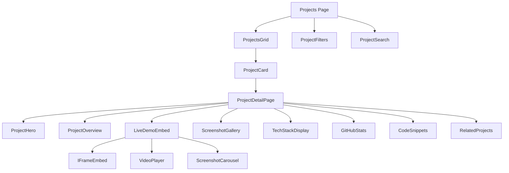
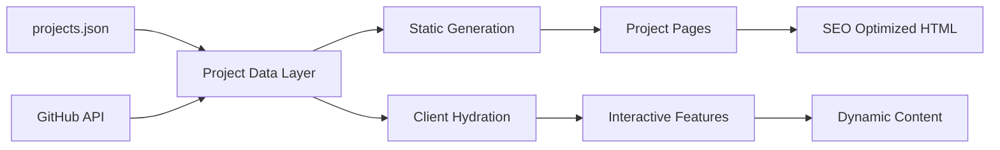

# Project Showcase System Architecture

This document details the architecture for the robust project showcase system - the centerpiece of the portfolio.

## System Overview

The project showcase system is designed to be the hero feature of the portfolio, with multiple views and interaction patterns to effectively demonstrate your work.

## Component Architecture



## Data Flow Architecture



## Project Data Structure

### Core Schema
```typescript
// lib/types/project.ts
export interface Project {
  // Identity
  id: string;
  slug: string;
  title: string;
  tagline: string;
  shortDescription: string;
  fullDescription: string;
  
  // Classification
  category: ProjectCategory;
  tags: string[];
  featured: boolean;
  priority: number;
  status: 'completed' | 'in-progress' | 'archived';
  
  // Links & Demos
  links: {
    live?: string;
    github?: string;
    download?: string;
    video?: string;
  };
  
  demoConfig: {
    type: 'iframe' | 'video' | 'screenshots';
    embedUrl?: string;
    videoId?: string;
    allowFullscreen?: boolean;
  };
  
  // Media
  media: {
    thumbnail: string;
    screenshots: string[];
    logo?: string;
  };
  
  // Technology
  techStack: TechStackItem[];
  architecture?: string;
  
  // Content Sections
  overview: {
    problem: string;
    solution: string;
    results?: string[];
  };
  
  features: Feature[];
  challenges: Challenge[];
  learnings: string[];
  
  // Metadata
  year: number;
  duration?: string;
  teamSize?: number;
  role?: string;
  
  // GitHub (fetched dynamically)
  github?: GitHubStats;
  
  // SEO
  seo: {
    title: string;
    description: string;
    keywords: string[];
    ogImage?: string;
  };
}

export type ProjectCategory = 
  | 'web-app' 
  | 'mobile' 
  | 'desktop' 
  | 'game' 
  | 'data-viz' 
  | 'full-stack';

export interface TechStackItem {
  name: string;
  category: 'frontend' | 'backend' | 'database' | 'tools' | 'cloud';
  icon?: string;
  color?: string;
}

export interface Feature {
  title: string;
  description: string;
  icon?: string;
}

export interface Challenge {
  title: string;
  description: string;
  solution: string;
}

export interface GitHubStats {
  stars: number;
  forks: number;
  watchers: number;
  openIssues: number;
  language: string;
  lastUpdated: string;
  license?: string;
}
```

## Component Breakdown

### 1. ProjectCard Component
**Purpose:** Reusable card for displaying project summary in grid/list views

**Features:**
- Animated hover effects (lift, glow, scale)
- Tech stack badges with icons
- Status indicators (live, GitHub stars)
- Quick action buttons (view, demo, code)
- Lazy-loaded images
- Responsive design (card/compact modes)

**Props:**
```typescript
interface ProjectCardProps {
  project: Project;
  view?: 'grid' | 'list' | 'compact';
  showActions?: boolean;
  priority?: boolean; // For image loading
}
```

### 2. ProjectsGrid Component
**Purpose:** Main container for displaying multiple projects

**Features:**
- Responsive grid (1-3 columns based on viewport)
- Sort options (recent, popular, alphabetical)
- View toggle (grid/list)
- Infinite scroll or pagination
- Empty state handling
- Loading skeletons

### 3. ProjectFilters Component
**Purpose:** Multi-faceted filtering system

**Filter Types:**
- Category (web, desktop, mobile, etc.)
- Technology (React, Node.js, Java, etc.)
- Status (completed, in-progress)
- Featured toggle
- Year range

**Features:**
- URL state synchronization
- Active filter chips
- Clear all option
- Filter count indicators

### 4. ProjectSearch Component
**Purpose:** Real-time search across projects

**Search Fields:**
- Title
- Description
- Tags
- Tech stack

**Features:**
- Debounced input
- Fuzzy matching (using Fuse.js)
- Search suggestions
- Keyboard navigation
- Clear button

### 5. ProjectDetailPage Component
**Purpose:** Comprehensive project showcase page

**Layout Structure:**
```
┌─────────────────────────────────────┐
│         Project Hero Section         │
│  Title, Tagline, Tech Badges, CTA   │
└─────────────────────────────────────┘
┌─────────────────────────────────────┐
│          Live Demo Section           │
│    iFrame/Video/Screenshots         │
└─────────────────────────────────────┘
┌──────────────┬──────────────────────┐
│   Overview   │    Quick Stats       │
│   Problem    │    GitHub Stars      │
│   Solution   │    Tech Stack        │
└──────────────┴──────────────────────┘
┌─────────────────────────────────────┐
│         Key Features Grid            │
└─────────────────────────────────────┘
┌─────────────────────────────────────┐
│      Technical Deep Dive             │
│   Architecture, Challenges, Code    │
└─────────────────────────────────────┘
┌─────────────────────────────────────┐
│       Screenshot Gallery             │
└─────────────────────────────────────┘
┌─────────────────────────────────────┐
│       Related Projects               │
└─────────────────────────────────────┘
```

### 6. LiveDemoEmbed Component
**Purpose:** Intelligent demo rendering based on project type

**Demo Types:**

**A. iFrame Embed (Web Apps)**
```typescript
<iframe
  src={project.demoConfig.embedUrl}
  className="w-full h-[600px] border rounded-lg"
  sandbox="allow-scripts allow-same-origin"
  loading="lazy"
/>
```

**B. Video Player (Desktop Apps)**
```typescript
<video
  src={project.demoConfig.videoId}
  controls
  className="w-full rounded-lg"
  poster={project.media.thumbnail}
/>
```

**C. Interactive Screenshot Gallery**
- Lightbox functionality
- Swipe navigation
- Zoom capability
- Captions

### 7. GitHubStats Component
**Purpose:** Display live repository statistics

**Data Points:**
- Stars, Forks, Watchers
- Primary language
- Last updated
- Open issues
- License type

**Implementation:**
```typescript
// Server component fetches at build time
async function getGitHubStats(repo: string): Promise<GitHubStats> {
  const response = await fetch(
    `https://api.github.com/repos/${repo}`,
    { next: { revalidate: 3600 } } // Revalidate hourly
  );
  return response.json();
}
```

### 8. CodeSnippets Component
**Purpose:** Showcase interesting code implementations

**Features:**
- Syntax highlighting (Prism.js or Shiki)
- Language detection
- Copy to clipboard
- Line numbers
- Theme-aware (dark/light)
- File path display

### 9. ScreenshotGallery Component
**Purpose:** Professional image showcase

**Features:**
- Responsive grid layout
- Click to expand (lightbox)
- Keyboard navigation
- Lazy loading
- Image optimization (Next.js Image)
- Captions and annotations

## File Structure

```
app/
├── projects/
│   ├── page.tsx                 # Main projects listing
│   ├── [slug]/
│   │   └── page.tsx            # Individual project page
│   └── loading.tsx             # Loading state
│
components/
├── projects/
│   ├── ProjectCard.tsx
│   ├── ProjectsGrid.tsx
│   ├── ProjectFilters.tsx
│   ├── ProjectSearch.tsx
│   ├── ProjectHero.tsx
│   ├── LiveDemoEmbed.tsx
│   ├── ScreenshotGallery.tsx
│   ├── GitHubStats.tsx
│   ├── CodeSnippets.tsx
│   ├── TechStackBadge.tsx
│   ├── RelatedProjects.tsx
│   └── index.ts
│
lib/
├── data/
│   └── projects.json           # Project metadata
├── types/
│   └── project.ts             # TypeScript interfaces
├── utils/
│   ├── github.ts              # GitHub API utilities
│   ├── search.ts              # Search functionality
│   └── filters.ts             # Filtering logic
│
public/
├── projects/
│   ├── covid-dashboard/
│   │   ├── thumbnail.png
│   │   ├── screenshot-1.png
│   │   └── screenshot-2.png
│   ├── e-store/
│   ├── shrink-it/
│   └── brick-breaker/
```

## Implementation Phases

### Phase 1: Foundation (Tasks 1-4)
- Set up Next.js project
- Configure Tailwind & TypeScript
- Create data structures
- Build basic layout

### Phase 2: Core Components (Tasks 5-8)
- ProjectCard component
- ProjectsGrid with layout
- Individual project pages
- Basic routing

### Phase 3: Advanced Features (Tasks 9-12)
- Live demo embeds
- Screenshot galleries
- GitHub API integration
- Syntax highlighting

### Phase 4: Refinement (Tasks 13-16)
- Search & filtering
- Related projects
- Deploy E-Store demo
- Polish interactions

### Phase 5: Portfolio Completion (Tasks 17-27)
- Navigation & hero
- About section
- CV integration
- Contact form
- Theme system
- SEO & deployment

## Performance Optimizations

### Image Optimization
- Next.js Image component with optimization
- WebP format with fallbacks
- Responsive srcsets
- Lazy loading below fold
- Blur placeholders

### Code Splitting
- Dynamic imports for heavy components
- Route-based splitting (automatic with App Router)
- Component-level splitting for galleries

### Caching Strategy
```typescript
// Static generation for project pages
export async function generateStaticParams() {
  return projects.map((project) => ({
    slug: project.slug,
  }));
}

// Revalidate GitHub stats hourly
export const revalidate = 3600;
```

### Loading States
- Skeleton screens for cards
- Progressive image loading
- Suspense boundaries for async components

## SEO Strategy

### Dynamic Metadata
```typescript
export async function generateMetadata({ params }): Promise<Metadata> {
  const project = getProject(params.slug);
  
  return {
    title: project.seo.title,
    description: project.seo.description,
    keywords: project.seo.keywords,
    openGraph: {
      title: project.title,
      description: project.shortDescription,
      images: [project.media.thumbnail],
      type: 'website',
    },
    twitter: {
      card: 'summary_large_image',
      title: project.title,
      description: project.shortDescription,
      images: [project.media.thumbnail],
    },
  };
}
```

### Structured Data
```typescript
const projectSchema = {
  "@context": "https://schema.org",
  "@type": "SoftwareApplication",
  "name": project.title,
  "description": project.shortDescription,
  "applicationCategory": project.category,
  "url": project.links.live,
  "author": {
    "@type": "Person",
    "name": "Pranoy Basu"
  }
};
```

## Accessibility Considerations

- Semantic HTML (article, section, nav)
- ARIA labels for interactive elements
- Keyboard navigation support
- Focus management in modals
- Alt text for all images
- Screen reader announcements
- Color contrast compliance (WCAG AA)

## Animation Guidelines

### Framer Motion Variants
```typescript
const cardVariants = {
  initial: { opacity: 0, y: 20 },
  animate: { opacity: 1, y: 0 },
  hover: { y: -8, transition: { duration: 0.2 } }
};

const staggerChildren = {
  animate: {
    transition: {
      staggerChildren: 0.1
    }
  }
};
```

### Performance
- Use `transform` and `opacity` for animations
- Avoid layout thrashing
- RequestAnimationFrame for custom animations
- Respect `prefers-reduced-motion`

## Testing Strategy

### Component Testing
- Unit tests for utility functions
- Component tests with React Testing Library
- Visual regression tests (Chromatic)

### Integration Testing
- Filter + search combinations
- Navigation flows
- GitHub API error handling

### Performance Testing
- Lighthouse scores (target 90+)
- Core Web Vitals monitoring
- Bundle size tracking

## Next Steps

1. Review this architecture with user
2. Confirm implementation approach
3. Switch to Code mode for development
4. Start with Phase 1 foundation tasks